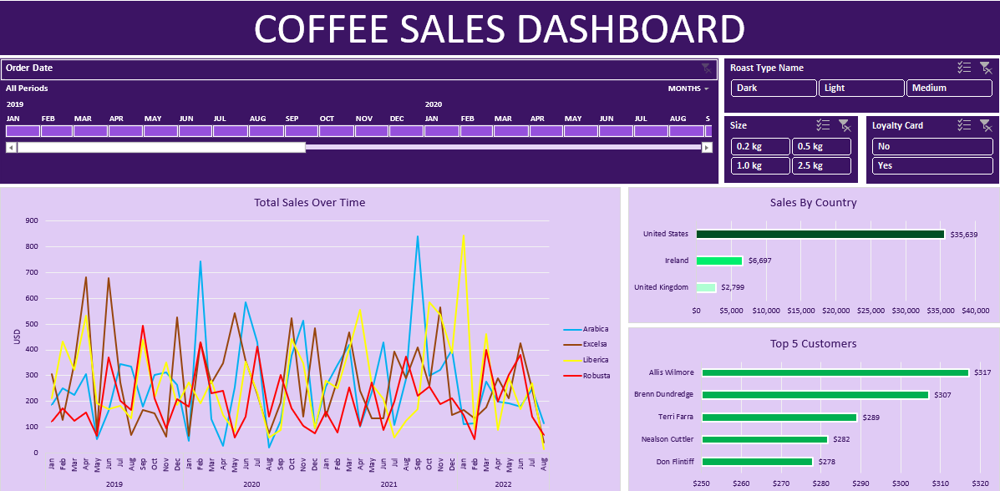

# ☕ Coffee Sales Dashboard
 
> Interactive Excel dashboard analyzing sales trends, customer performance, and regional distribution across a multi-year coffee retail dataset.
 
---
## 📌 Overview
 
This project demonstrates end-to-end data work in Excel — from raw, fragmented data across multiple sheets to a fully interactive business dashboard. It covers data retrieval, transformation, cleaning, pivot analysis, and dashboard design with a focus on usability and visual clarity.
 
---
 
## 🗂️ Dataset
 
- **Source:** Multi-table workbook with separate `orders_raw`, `customers`, and `products` sheets
- **Size:** ~1,000 orders across 3 countries (United States, Ireland, United Kingdom)
- **Period:** 2019 – 2022
- **Products:** 4 coffee types × 3 roast levels × 4 bag sizes
---
 
## 🔧 Data Preparation
 
### Retrieval
Consolidated fragmented data from three sheets into a single analysis-ready table using:
 
| Function | Fields Retrieved |
|---|---|
| `XLOOKUP` | Customer Name, Email, Country, Loyalty Card status |
| `INDEX MATCH` | Coffee Type, Roast Type, Size, Unit Price |
 
> `INDEX MATCH` was preferred over `XLOOKUP` for product fields as a single formula could be dragged across multiple columns, reducing redundancy.
 
### Transformation
- Calculated `Sales = Unit Price × Quantity`
- Expanded abbreviations to full names using nested `IF` statements (e.g. `Rob` → `Robusta`, `M` → `Medium`) for dashboard readability
### Cleaning
- Standardized date formatting to avoid regional ambiguity (e.g. `05-Sep-2021`)
- Applied USD currency formatting to price and sales fields
- Added custom `kg` unit formatting to bag size values
- Removed duplicate records via Excel's built-in deduplication tool
- Converted the dataset to a structured **Excel Table** (`Ctrl + T`) to ensure pivot tables update automatically when new data is added
---
 
## 📊 Dashboard Features
 
### Sales Over Time
Line chart tracking monthly revenue by coffee type, with an interactive **timeline** for date-range filtering.
 
### Sales by Country
Horizontal bar chart comparing total revenue by region, sorted descending to surface top-performing markets at a glance.
 
### Top 5 Customers
Ranked bar chart identifying the highest-value customers by total spend.
 
### Interactive Filters
Three **slicers** - Roast Type, Bag Size, and Loyalty Card status, are connected to all three pivot tables simultaneously via Report Connections, so every chart updates in sync with a single click.
 
---
 
## 🗃️ Workbook Structure
 
| Sheet | Description |
|---|---|
| `Dashboard` | Final view — all charts and slicers |
| `TotalSales` | Pivot table powering the sales-over-time line chart |
| `CountryBarChart` | Pivot table powering the sales-by-country bar chart |
| `Top5Customers` | Pivot table powering the top customers chart |
| `orders_transformed` | Cleaned, enriched working table used by all pivot tables |
| `orders_raw` | Original unmodified source data |
 
---

## 💡 Skills Demonstrated
 
`Data Transformation` · `XLOOKUP` · `INDEX MATCH` · `Pivot Tables` · `Pivot Charts` · `Data Cleaning` · `Dashboard Design` · `Slicers & Timelines` · `Excel Tables` · `Data Formatting`
 
---
## 📷 Preview
 

 
---
